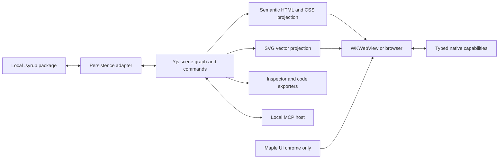

# Sugar Maple MVP architecture recommendation

Status: planning baseline updated to reflect the user architectural clarification; validate renderer behavior and performance in the first implementation issue. No renderer benchmark or implementation has been completed in this planning task.

## Decision

Use **HTML + inline SVG** inside a shared Angular editor, hosted by WKWebView on macOS and by the browser on web. HTML/CSS renders platform-agnostic live controls, typography, frames, stacks and layout. `_Maple` supplies the editor chrome/shell only: panels, toolbars, trees, inspector overlays, icons and host theme tokens. SVG renders vector shapes, paths, connectors and selection affordances. Canvas can support raster export or a later measured stroke optimization. HTML + SVG is the rendering architecture.

| Option | What it does well | MVP cost | Decision |
| --- | --- | --- | --- |
| Canvas 2D | Dense drawing and explicit render control; closest to Just-Maple's existing renderer | Reimplement real UI controls, text editing, hit testing, accessibility and layout; code identity must still live separately | Keep existing Canvas 2D as a reference |
| SVG only | Vector geometry, DOM picking, crisp paths and SVG serialization | Real Angular controls and CSS layout need HTML integration; foreignObject adds export complexity | Use for vector content and overlays |
| HTML only | Standard live controls, browser typography, inputs, CSS Flexbox/Grid and semantic handoff | Arbitrary paths, connectors and vector editing are awkward | Use for live UI and layout |
| HTML + SVG | Combines real components and vector geometry in one browser/WebView runtime | Must solve mixed stacking, clipping, common transforms and export; DOM growth requires culling | Recommended MVP baseline, subject to measured spike |

This is an engineering recommendation based on the requested UI reuse and handoff. It does not establish performance superiority. Canvas does not preserve drawn items as semantic DOM elements; SVG exposes vector content through its DOM. See [MDN Canvas](https://developer.mozilla.org/en-US/docs/Web/HTML/Reference/Elements/canvas) and [MDN SVG](https://developer.mozilla.org/en-US/docs/Web/SVG).

## Host UI versus canvas output

**`_Maple` is the UI library for authoring the Sugar Maple application chrome/shell; the canvas renders arbitrary UI compositions that map outward to standard code-export targets.** Sugar Maple is a visual UI workbench, not a previewer constrained to a photo application component catalog.

Pinned, tree-shaken Maple components, icons and token styles are imported only by the chrome runtime. The scene schema, canvas projection, layout engine and portable exporters cannot import those host implementations. Enforce this with dependency checks and an isolated canvas fixture. Scope chrome CSS so it cannot style authored content or exported preview by accident.

The document owns its token registry and optional design-system bindings. Initial Maple token seeds are copied explicitly as document data with provenance; symbol mappings describe optional export targets. Neither creates a runtime dependency on host controls. Users can design with unrelated tokens and custom components; switching the editor theme must not change their design.

Portable outputs are clean Angular templates/components, semantic HTML5 with Tailwind 4 or CSS, idiomatic SwiftUI structs with native state/bindings, and standard DTCG tokens mapped to CSS custom properties. Optional library-specific snippets are separate targets.

## Runtime boundaries

The local Yjs scene graph is the single authoritative source of truth. The versioned scene graph owns stable node IDs, optional design-system bindings, props, slots, tokens, layout rules and prototype links. Rendered DOM and generated code are projections. All mutations, including paste and MCP, use the same validated transaction dispatcher. MCP remains embedded/local-only, with Streamable HTTP at `127.0.0.1:48480` and a stdio transport adapter; every agent mutation uses an atomic, undoable `AgentTransaction` without corrupting human history. Native SwiftUI is a copy/export target, not a second editor implementation.

Ordered node wrappers can contain HTML or inline SVG, with separate selection overlays. A single global SVG layer above all HTML would break arbitrary mixed z-order. Validate transforms, nested clipping, pointer capture, text IME, keyboard focus and editor/preview event routing in the first spike. Avoid depending on SVG foreignObject for all live controls or pretending serialized DOM is portable SVG.

Browser CSS is the layout authority for MVP; store declarative rules and keep measured geometry derived. Restrict exporters to supported semantic structures with explicit unsupported diagnostics. Keep selected/edited nodes mounted when culling.

## What was inspected

- `_Maple` at `dc6205dbd5ea8031510777e3031abad50cb7e2e7`: `docs/unified-component-catalog.md`, web `maple-common` package/public API, real `mui-button`, SwiftUI `MuiButton`, whiteboard canvas wrapper and component contracts. Angular 21.2 and Tailwind 4 appear in package manifests. Maple UI lives inside a broader photo-app library; the public barrel exports unrelated RAW processing/services. Build a narrow, pinned, tree-shaken chrome-only dependency with tokens, icons and fonts, not a sibling-path-only import.
- `Just-Maple` at `38c2e6793b4602418b669909865d2292d43a842d`: `packages/whiteboard` renderer, canvas template, tools, model and Yjs document service; Apple `WebViewController.swift` and `NativeBridge.swift`. The renderer calls `getContext('2d')` and traverses visible layers/elements. Its element union is strokes/shapes/text, so components and layout need new schema work. Yjs persistence initializes IndexedDB before server connection, but includes notebook/auth/server integration to remove.
- Just-Maple WebView loads a configured server; the bundled fallback is an offline page and service-worker caching depends on an earlier successful load. Reuse bridge/container patterns, bundle the full Sugar Maple editor for first-run offline use.
- Current Sugar Maple folder has `product.md` and an Xcode hello-world scaffold, no local `.git` directory. The requested GitHub remote exists with no default branch or issues at inspection time. Existing files were preserved; this planning task does not initialize or push app code.

These are implementation observations, not proof that sibling packages currently compile or satisfy this project's requirements. Upstream revision links are included in the issues; integration must audit licensing, transitive dependencies and current APIs.

## MVP scope and explicit amendments

| Topic | RFC / existing PRD | MVP baseline |
| --- | --- | --- |
| Name | RFC Syrup; PRD Sugar Maple | Sugar Maple product; `.syrup` documents |
| Persistence | RFC flat binary/JSON-LD; PRD directory bundle | Versioned `.syrup` directory, JSON checkpoint + Yjs log + assets; browser archive fallback |
| Renderer | Unified scene graph | HTML + SVG, verified in a spike |
| Layout | Native Taffy/Yoga / CSS parity | Browser Flexbox/Grid subset, manual constraints and content-aware layout |
| Platforms | macOS, browser/WASM, iOS preview | macOS + browser editor; SwiftUI export; iOS live companion later; no mandatory WASM runtime |
| CRDT | Document graph plus live peer collaboration | Local Yjs and transactional undo; convergence fixtures now, network sync later |
| Vector tools | Full vector pipeline and Boolean topology | Basic geometry, simple paths/freehand and bounded sanitized SVG import/export |
| Components | Master/variant/state matrix | Platform-agnostic primitives and user masters; optional namespaced mappings including Maple; slots/overrides and common states |
| Repeat Grid | Structural clones + arbitrary data overrides | Template plus text/image overrides, rows/columns/gaps, CSV/JSON/image population |
| Prototyping | Auto-animate, voice, spring physics, variables | Click-through navigation/back/overlays, instant/dissolve and responsive preview |
| Handoff | Property extraction | Names + portable Angular + HTML/Tailwind 4 + CSS + idiomatic SwiftUI + structured copy/paste; optional library mappings |
| MCP | Legacy stdio/SSE, conflicting fixed ports | stdio + loopback Streamable HTTP; 127.0.0.1:48480; actionable port conflict error, no silent fallback; stdio remains available |
| Performance | 10,000+ nodes at 60–120 FPS; <1.2s load | Proposed 1,000 total/200 visible mixed-node p95 <=16.7ms reference target; original scale goals remain diagnostic/future gates |

These scope reductions are planning recommendations, not a claim to fulfill every PRD P0. Post-MVP issues preserve the deferred requirements. Current MCP documentation identifies Streamable HTTP as the replacement for the old HTTP+SSE transport: [MCP transport specification](https://modelcontextprotocol.io/specification/2025-11-25/basic/transports).

## Developer copy/paste contract

For every selected node, preserve its authored name, exact props/variant/label and document token identity. Optional design-system bindings add a namespaced name, source version and mapped symbols (for example `mui-button` and `MuiButton`). Unmapped/custom nodes still render and export. Offer separate name, portable Angular template, semantic HTML + Tailwind 4, plain CSS, idiomatic SwiftUI, optional mapped component snippet and editable-element copy actions. Default exports compile without Maple libraries; mapped exports explicitly declare their external dependencies.

“Native UI” is covered both as native HTML controls and as SwiftUI code for the first native platform. Copying code does not imply arbitrary source-code import. Structured Sugar Maple payloads retain full semantics across documents; external HTML/Tailwind paste is bounded to a sanitized documented subset. Swift/Angular/JavaScript source is never evaluated on paste.

## MVP completion scenario

On a fresh offline macOS install: create two responsive artboards using semantic primitives and a user-created non-Maple component, add repeated content and local assets, connect a button to the second artboard, preview at desktop/tablet/mobile widths, inspect a component name and tokens, copy working web/native snippets, paste an editable frame into a second document, save/restart/reopen, then perform and undo one MCP edit. Run the equivalent browser-supported flow and compile the generated code fixtures. A release is blocked until all linked MVP issues pass their acceptance criteria.
