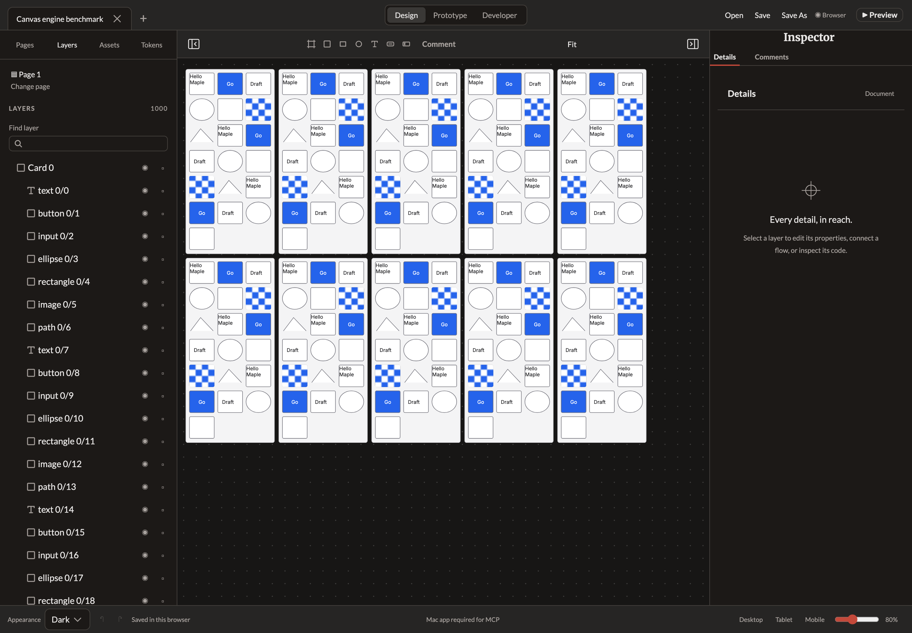
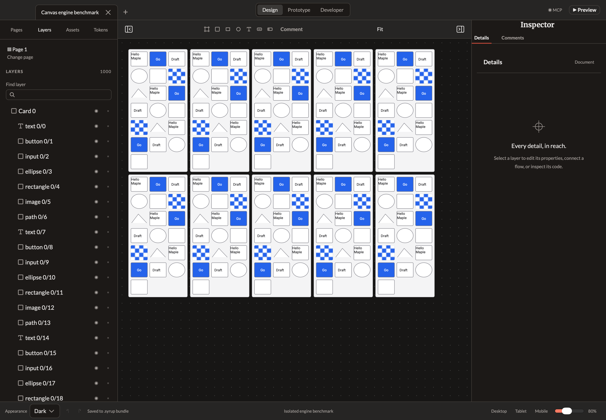

# Production Canvas engine measurements — October 1, 2026

The implemented Canvas/DOM architecture remains in place. This experiment extends issue #2 beyond its earlier warm CPU flush diagnostic and measures the normal event/Angular/Canvas scheduling path in both Chrome and a visible WKWebView. It also exposes editor cost from the full Layers DOM. The proposed release p95 ≤16.7 ms gate is **not achieved by this evidence**; #2 and #8 remain open.

## Recorded run

Production source main `579122d1e5212cc5d9856384923fd16b69db0759`; benchmark tooling `0063394`. Apple M5 Max / 128 GiB, macOS 27.0, Chrome 154.0.8037.93, 1440×1000 content area, DPR 2, actual design viewport 840×864. Full versions, bundle/source/fixture hashes, startup observations and raw samples accompany this record. The generated checkpoint is identical across engines at each size. Each phase has 360 samples; the same 200 mixed nodes paint during camera movement, including 20 pixel-verified images. Every measured phase leaves the complete authored checkpoint and history unchanged.

| Engine | Total / visible | Navigation to observed fixture | Idle p95 interval | Pan p95 interval | Zoom p95 interval | Open Layers | Pan with Layers p95 interval |
| --- | --- | --- | --- | --- | --- | --- | --- |
| chrome | 1,000 / 200 | 484 ms | 18.3 | 18.4 | 18.5 | 93 ms | 18.3 |
| chrome | 10,000 / 200 | 1732 ms | 18.4 | 18.5 | 18.4 | 1148 ms | 33.7 |
| webkit | 1,000 / 200 | 721 ms | 19.0 | 18.0 | 20.0 | 140 ms | 23.0 |
| webkit | 10,000 / 200 | 4136 ms | 18.0 | 24.0 | 20.0 | 1294 ms | 24.0 |

Intervals are milliseconds. They are rAF scheduling observations rather than hardware presentation timestamps. Callback p95 exceeds the nominal 16.7 ms proposal even while idle, so these numbers cannot establish the release display SLA. There is no raised budget or relaxed acceptance test.

CPU painting p95 is approximately 1.8–2.2 ms in Chrome and 3–4 ms in WKWebView. Chrome's 10,000-row Layers case has 98/360 intervals exceeding 1.5× its measured idle median, versus zero for its same-size Pages/pan/zoom phases. The native case varies independently; its 10,000-row Layers pan p95 is 24 ms, with 13/360 intervals beyond the same cadence rule. These observations identify full editor/DOM work for profiling; they do not isolate a single function as the cause.

After opening Layers, Chrome's reported JS heap used is about 45.2 MiB at 1,000 nodes and 398.0 MiB at 10,000. Owned-process RSS snapshots are also retained; they can double-count shared pages and include automation/trace overhead. The native harness owner's peak RSS is about 225.0 / 706.9 MiB, includes its in-memory fixture scaffolding, and excludes WebKit content/GPU/network processes. Those memory scopes are not directly comparable and are not full native-app release measurements.

## Reproduce and inspect

Run `bun run build:web` and `bun tools/canvas-engine-benchmark.ts` on a visible macOS desktop with Chrome. A fresh browser context is seeded using the actual browser RecoveryStore, avoiding the localStorage quota. A separately identified native harness loads the actual production bundle with the shared native origin/resource policy, a nonpersistent data store and a fixed recovery/status/autosave bridge. It exposes no clipboard, document disk I/O or MCP capabilities. The normal AppKit event loop and visible-window checks are required; a hidden-window run fails. Servers, contexts and native windows belong to this experiment and are closed on completion; user app/profile/clipboard/port are untouched.

All timing inputs in the shared harness are synthetic WheelEvents through the real wheel handler. Chrome separately verifies one trusted Playwright wheel. Neither provides hardware input-to-photon latency. The fixture includes grid frames, multiline text, semantic controls, ellipses, rectangles, decoded raster images and paths. The generated 10,000-node checkpoint is about 19 MB and is diagnostic, not a promised SLA.

The canonical raw measurements are the four engine JSON files and `run-state.json` with `state: passed`. Chrome compositor/pipeline traces remain locally at `build/canvas-engine-benchmark/chrome-{1000,10000}.trace.json.gz`, with committed hashes in `trace-and-image-hashes.json`; the multi-megabyte traces are not included in this documentation commit. Screenshots show actual measured editors with their Layers panels open.

The initial harness attempts are not evidence of delivery: a localStorage-based 10,000-node seed exceeded the browser quota, a command-line native main could evaluate JavaScript without an unoccluded window, and a one-pixel placeholder had an invalid PNG CRC. The final runner uses actual IndexedDB setup, AppKit's event loop, a valid visible checker image and exact pixels for all visible image nodes. A sidebar selector was corrected to the actual button-based navigation. No product budgets were changed to pass these checks.

## Remaining acceptance

Issue #2 still needs an agreed reference machine/display, repeated representative workloads with the real native recovery path, whole-process memory attribution and compositor/presentation evidence. Issue #8 still needs Layers virtualization and remaining manipulation/navigation acceptance. The [renderer decision](../../development/renderer-decision.md) records the user-requested architectural amendment and preserves the broader release requirements.

