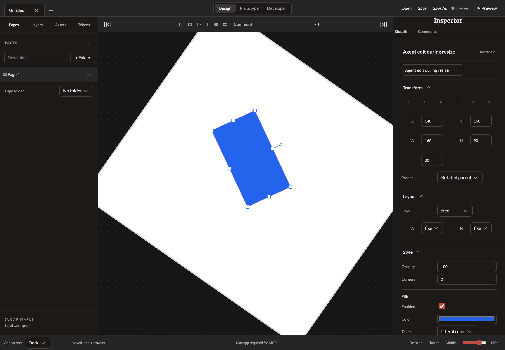
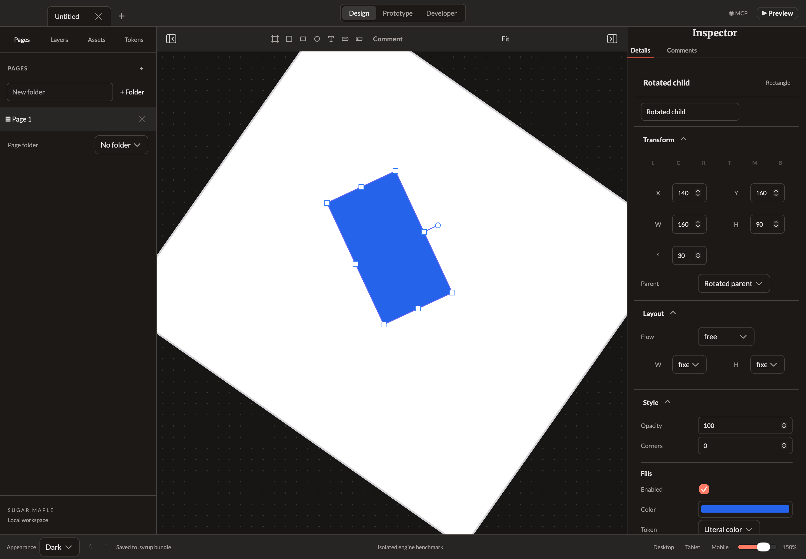
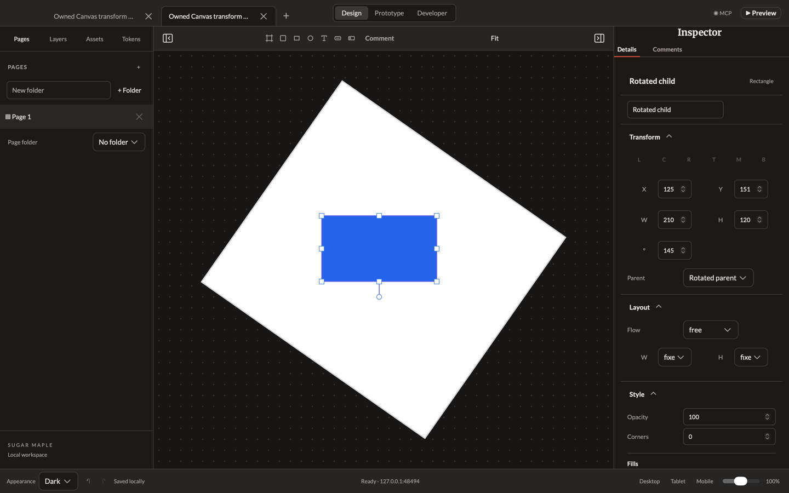

# Canvas transforms — October 2, 2026

The previous editor exposed one bottom-right resize grip and refused movement/resizing beneath rotated parents. Design now exposes eight resize grips and a rotation grip, positioned from the same scene matrices used by Canvas painting. Rotated free-layout nodes resize with the opposite corner/edge center pinned in world coordinates. Pointer movement and keyboard nudging convert world deltas through the parent transform. Shift-drag preserves proportions; Shift-rotation snaps to 15 degrees. Accessible grip buttons have visible focus and keyboard instructions; Arrow keys edit by one unit/degree, or ten with Shift.

One pointer gesture commits one atomic undo step. Pointer cancellation, blur, Escape, mode/page/document changes and concurrent revisions discard the draft. Reaching size/placement limits does not create an empty transaction. A pan over a grip cannot arm a later resize. Locked/hidden ancestors block hit testing, marquee, transform grips and Canvas nudging. The authored scene remains canonical; the existing Whiteboard owns camera and pointer capture.

Local acceptance passes 85 model tests / 1,535 assertions, TypeScript, Maple inventory, production web/Mac builds and all 24 browser/consumer suites. The new Chrome suite uses actual browser mouse capture and keyboard input at DPR 1/2 and zoom 0.5/1.5. It checks every resize grip, opposite-anchor geometry, Shift proportions, rotation, world-axis nudge, exact undo/redo, cancellation, agent revision, live mode changes, inherited locks/visibility, pan arbitration and no-op limits. Geometric anchors use a 1e-6 world-unit tolerance; DOM grip placement accounts for CSS's 1/64-pixel layout quantization. Initial test-only fixture naming, CSS quantization and unsettled-history observations were corrected without weakening the world-anchor checks; original diagnostic logs remain in ignored `build/`.

The complete native acceptance run passes. A fresh visible production WKWebView passes 18 resize/rotation **synthetic DOM keyboard** cases at both zooms against an independent fixed/free rotated world-point calculation. Its harness exposes only fixed in-memory recovery/status/autosave. A separate DEBUG app/profile on port 48494 is exercised through the real Sugar Maple HTTP MCP and pinned SDK: nested transformed layout, selection, PNG capture, atomic edits, exact undo/redo and durable native checkpoint all pass. The runner owns and terminates only that QA process. The user's app/profile/port and OS clipboard are untouched.

QA server-console inspection additionally exposed an initialization error: the cancellation effect could call Whiteboard's blur handler before its required `activeTool` input was bound. Cancellation now uses Angular's after-render effect, so bindings exist on initial and subsequent renders. Chrome checks console errors as well as uncaught page errors; the WK owner installs startup console/error tracking before the editor loads. Both gates pass with zero errors after the fix, and full browser/native acceptance was rerun. Browser logs end with the expected SIGTERM messages from the test runner's owned server cleanup; the runner itself exits successfully.

[Run state](run-state.json) binds the committed source, every production bundle file, environment, screenshots and raw acceptance logs. [WK report](webkit-report.json) and [native MCP report](native-mcp-report.json) keep their scopes explicit. The performance harness's default mode and timing loops are unchanged; its optional transform mode reuses only the visible WK owner/resource bridge.

This is an implementation candidate until actual PR approval, exact-head CI, merge and successful resulting-main checks. It advances #8 without closing its broader requirements. Snapping/distribution, complete native OS pointer/IME/VoiceOver acceptance and the full performance gate remain open. Manual resizing is available for fixed-size nodes in free parent layouts; managed/hug/fill sizing remains governed by layout, with broader constraints work in #10. These checks establish neither the 16.7 ms physical frame gate nor complete accessibility/release acceptance.

Reproduce after installing the existing lockfile dependencies:

```sh
node_modules/.bin/bun test ./src/web/tests
node_modules/.bin/bun run --cwd src/web typecheck
node_modules/.bin/bun tools/maple-inventory.ts
node_modules/.bin/bun run build:mac
node_modules/.bin/bun tools/browser-acceptance.ts
node_modules/.bin/bun tools/native-acceptance.ts
```

Browser acceptance owns a loopback server if port 4200 is free. Native acceptance requires macOS; it creates only owned profiles under `build/`. The individual WK/MCP runners can be invoked as `tools/native-canvas-transform.ts` and `tools/native-canvas-transform-mcp.ts` after the production build.






