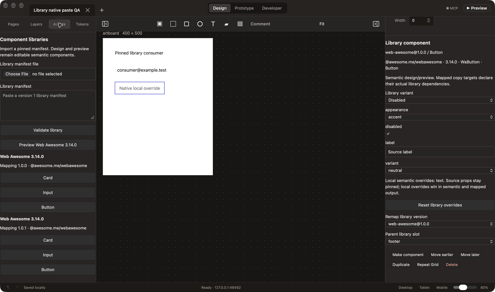
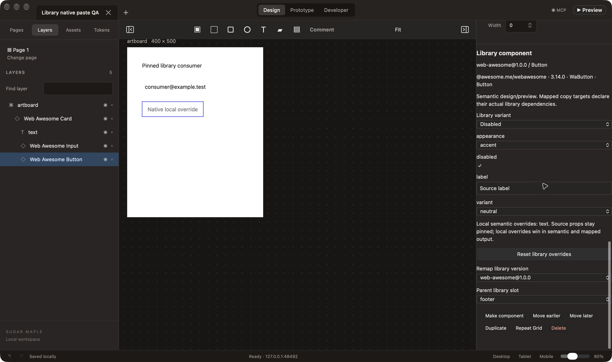
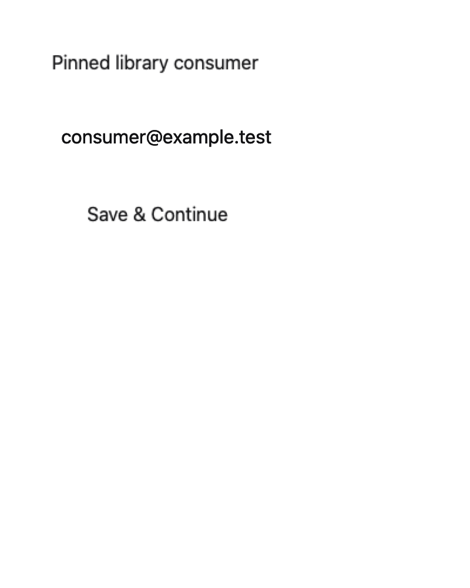

# Production library manifest acceptance — October 1, 2026

Issue #49 implements pinned metadata import, editable library instances, an Assets picker and typed inspector, explicit remapping, persistent props/variants/slots/local overrides, cross-document dependency/token retention, and optional mapped web/SwiftUI exports. The non-Maple fixture uses actual Web Awesome 3.14.0 Button/Input/Card APIs. All 13 direct dependency pins are recorded, and the isolated npm consumer commits the full transitive lock. [Usage, schema rules, offline behavior, update rules and supported boundaries](../../development/libraries.md) are documented separately.

Validation passes: 66 model tests / 464 assertions; 21 browser and consumer suites; final targeted library tests for same-file reselection and readable themed controls; TypeScript checking; production web and Mac builds; six native fixtures, stdio transport and four compiled macOS SwiftUI consumers. The isolated web consumer checks actual declarations, bundles actual package imports, edits a real shadow input, validates Card spacing and named slots, and renders with non-local network requests denied. The native mapping compiles Button/TextField/VStack against the macOS 14 API baseline and renders in an actual `NSHostingView`. The fixture declares macOS only; iOS and visual equivalence to the web package are not claimed.

Actual native SDK tests used only the owned Debug app `io.zubair.SugarMaple.LibraryQA`, profile `build/library-qa/profile`, port 48492. They prove atomic invalid-prop/unsafe-manifest rejection without checkpoint mutation, source props with local semantic overrides, scoped library metadata, both mapped targets, cross-document editable paste, and durable autosave. CUA then chose the owned JSON through the actual NSOpenPanel, validated it, cancelled, chose the same file again and applied it. The SDK proved exact checkpoint/journal equality during both previews, one journal entry on apply, unchanged existing nodes and exact undo/redo. Normal quit/reopen retained the complete checkpoint and undo journal. The final source bundle also reopened it and showed the retained source label, Disabled variant, footer slot and local text override in the native inspector. The owned app was quit after QA.

Three product fixes came from this QA/review: clear the native file input before reading so the same file can be chosen after cancel; use actual editor theme colors so imported JSON and prop controls remain readable; retain cross-document token aliases when resetting instance overrides. Each has a meaningful regression. Test observations are preserved: the first handoff selector matched two file inputs and now uses the image control's explicit accessible label; the first isolated-consumer harness redundantly rewrote Bun's already-written bundle to itself, truncating it, and the corrected harness passed; one native observation interrupted and resumed the existing picker. Existing stylesheet budget and weak-variable warnings remain visible in raw logs.

This candidate requires exact-head CI, an actual approving review and merge before #49 closes. Executable JS/Swift preview remains #51. Complete registry/publish behavior (#12/#26), full responsive/export/native parity (#16/#17/#25), and release acceptance/packaging (#21/#27) remain open. Mapped web output explicitly rejects unrepresented local styles and unsupported responsive sizing; native output rejects unsupported variants, properties, platforms and slots. Raw logs and `verification.json` record each check's scope.

## Recovered review and current-main integration

The original reviewer session `1449360678406360133` timed out while awaiting a question. Reviewed workflow changes #70/#71 recovered the actual question and submitted one hash-bound continuation to that same retained session. Inspection then proved COMPLETED and the final review was recovered by workflow [36954836780](https://github.com/zubair-io/Sugar-Maple/actions/runs/36954836780). Its actual `VERDICT: comment` and verified identity context are retained here; no timeout status was rewritten or approval invented.

The final review found a concrete detached-slot clipboard bug and a default-slot validation omission. Both are fixed: an external slot is cleared only when its parent is removed from the pasted tree; retained children keep their named slots. All children of a known library parent, including the empty default slot, require that manifest declaration. Ordinary frames and missing-manifest editable fallbacks retain their existing contract. Store regressions prove subtree retention, save/replay, independent ID remapping, atomic invalid-slot rejection and one undo; the actual browser editor Copy element → keyboard paste → one undo flow also proves a slotted child can be copied alone. Its clipboard is private in-page test storage and never accesses the user's general pasteboard.

Verified main `579122d` (Maple chrome/native structured clipboard/reviewer continuation) was merged with one resolved inspector-template conflict. The updated source builds in the actual Mac app and passes the complete native acceptance runner, including actual compiled SwiftUI consumers; 22 full browser/consumer suites pass after integration, followed by the new targeted UI regression. The project-pinned Bun 1.4.2 passes all 68 model tests / 481 assertions. Global Bun 1.4.3-canary runs hit the existing five-second 5,000-node test limit, including an isolated run; these observations are retained. The declared runtime was used for the final pass, and the timeout/budget was not raised. Production typecheck/build and the native tests pass on the merged source.

A fresh exact-head review and CI run are still required for these fixes before merging #67 and closing #49. The prior final comment is source evidence for the findings, not approval of this changed head.
