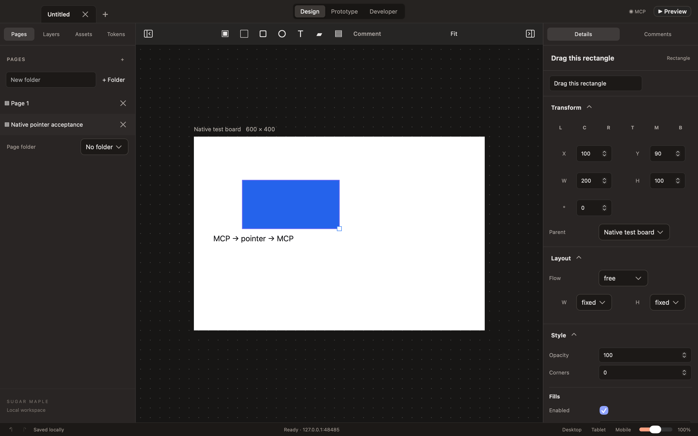

# MCP contract hardening — October 1, 2026

Issue #20 now has versioned response schemas, structured results and typed errors verified by the pinned MCP SDK. Text content remains compatible. Native `tools/list` describes implemented outputs, including revision-bound capture metadata and explicit error envelopes.

The native server uses a private credential directory and monotonic capture admission. Explicit stop cancels the listener/connections and removes only its own credential; normal application termination invokes it. Credential-rotating restart, occupied ports, typed failures and deterministic throttling have real Network.framework transport fixtures. The stdio unavailable-host path emits actionable, protocol-clean JSON-RPC.

[Verification](verification.json) records 41 model tests / 206 assertions, all 15 browser suites, production typecheck/web/macOS builds, native filesystem/socket fixtures, real HTTP/stdio discovery/validation, actual pointer readback/undo and normal quit/restart/reconnect. The browser runner succeeded and then stopped its owned dev server; trailing 143 logs are that cleanup. Native socket failures are injected by a controlled editor delegate; actual WKWebView validation is separate.

Feature-specific MCP resources/tools and scoped reads remain #27/#50. This does not close those broader capabilities or the MVP release gate.
