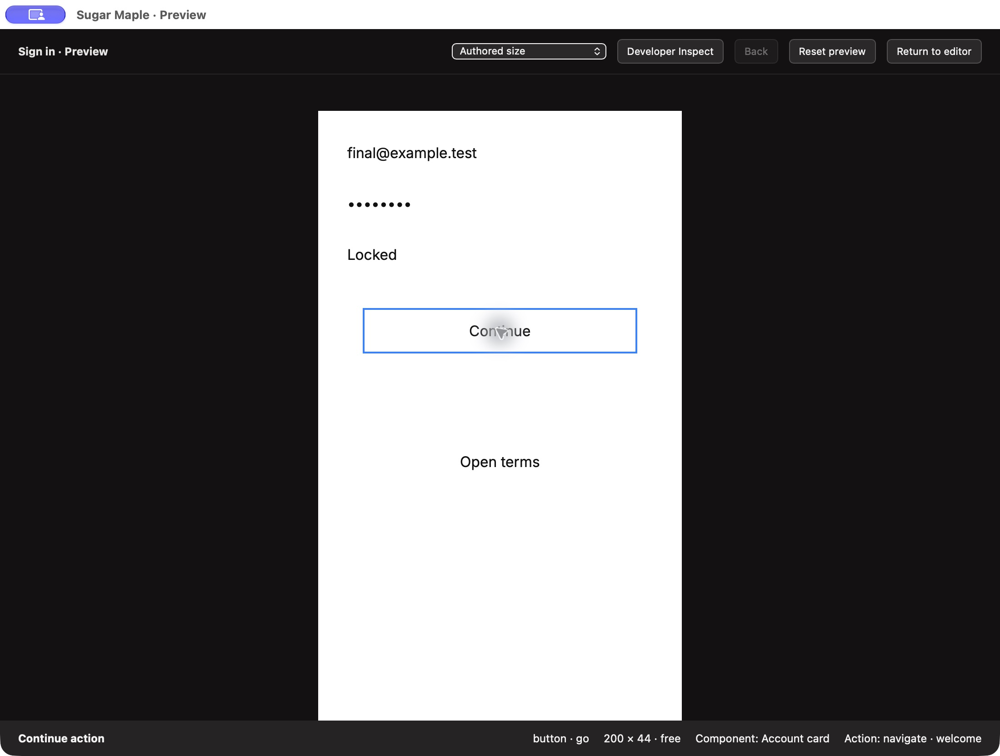
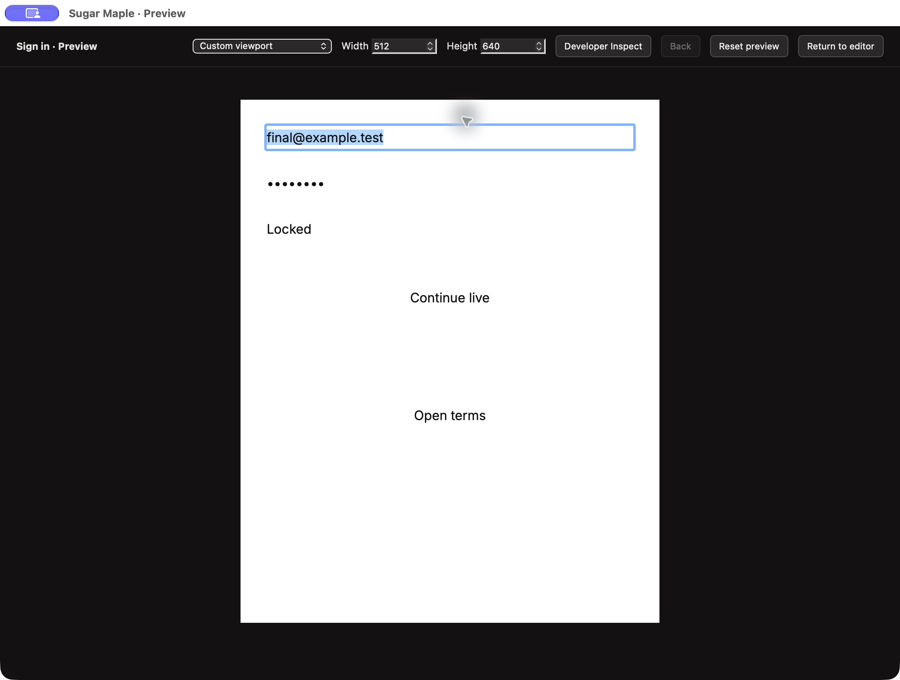

# Isolated native preview acceptance — October 1, 2026

Issue #14 now has a separate responsive macOS preview window and Developer Inspect mode. The authoring window remains usable. Live immutable scene snapshots feed a separate Angular application; it instantiates no EditorService, document store, autosave/recovery service or privileged native handler. The preview uses an ephemeral WKWebView data store on `sugar-maple://preview/index.html#preview`, with bundled resources constrained to that origin. Its only message handler accepts close/return-to-editor. File/clipboard/MCP requests, foreign origins, other routes and subframes have no privileged bridge.

The shared scene renderer uses authored DOM controls and the same layout projection as browser preview, with no imported host Maple controls. Authored size, 1440/834/393 width presets and a validated 240–4096 pixel custom width/height viewport are ephemeral; larger stages scroll. Typed input, navigation history, overlays and inspection selection remain separate from the document. Reset restores initial runtime values. Inspect can select the deepest nested component/action without navigating or editing an input and reports its node, component and fill-token identity. Full mapped developer handoff remains #15.

Same-document newer snapshots retain runtime values and navigation. Older/duplicate revisions are ignored. Document replacement closes preview; deleted destinations return to the starting artboard with a diagnostic, and deleting the starting artboard closes the window with an editor diagnostic. Close cancels readiness/prototype timers, removes the handler and observer, destroys the Angular renderer, clears the WebView document and restores editor focus. An actual weak-reference test verifies the controller is released; repeated close and parent-window close are exercised.

The first stronger network test exposed a real flaw: WebKit ignored a document-start CSP meta outside the not-yet-created head. The fix inserts the policy into the actual bundled HTML head before any script parses. The native test now requires an actual `securitypolicyviolation` event for `connect-src`, rather than treating a DNS/network error as isolation evidence. Bundled fonts still load offline; external connections, frames, objects and form submission are denied. Scene validation independently rejects executable/external asset content. No operating-system network settings were changed.

Validation passes: 53 model tests/336 assertions, 18 browser/consumer suites, typecheck, production web/mac build, five real native fixtures, two compiled SwiftUI consumers, unavailable-host stdio and the actual 15-tool MCP HTTP/stdio integration. The browser tests run the prototype offline, compare Canvas/DOM layout, exercise custom viewport bounds and scrolling, suppress nested actions in Inspect, preserve the complete authoring checkpoint and test isolated bootstrap/live/stale-feed/disposal. Native fixtures run the actual bundled WKWebView, deny file commands/navigation/external connections, preserve runtime input through a live edit, and verify overlays/navigation/reset and cleanup. The generic MCP integration's discovery assertion was updated from 13 to the 15 tools already shipped by #59 and verified against the actual SDK.

Native CUA testing used only the owned Debug app `io.zubair.SugarMaple.PreviewQA`, `build/native-preview-qa/profile`, port 48490. `tools/native-preview-mcp.ts` refuses other profiles/ports. Its fixture contains two screens, email/password/disabled inputs, an overlay and a nested component action. Actual keyboard input, Inspect, overlay/Escape focus, live MCP changes, deleted destinations/root, custom dimensions, Reset, close/reopen and return-to-editor focus were verified. The final HTML-CSP build was relaunched and its form/Inspect/live/overlay/navigation/Back/custom/reset/close flow verified again. Initial AX input clicks did not focus reliably; keyboard focus and successful input are recorded instead. The complete checkpoint and undo journal stay equal between intentional MCP design edits. Screenshots show the final native build.

This candidate still requires exact-head CI, review and merge before #14 closes. Large-scene/release acceptance and production mapped or executable libraries remain #2/#21/#49/#51. The raw logs and verification.json record scope and limitations.

