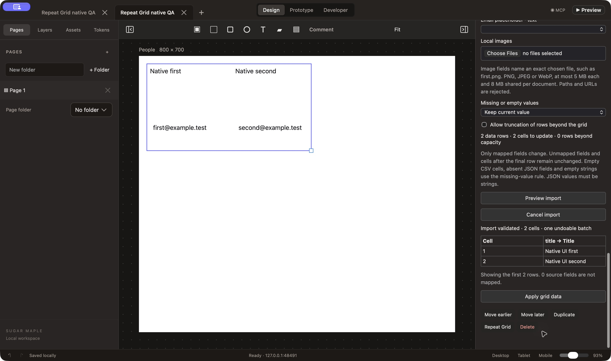
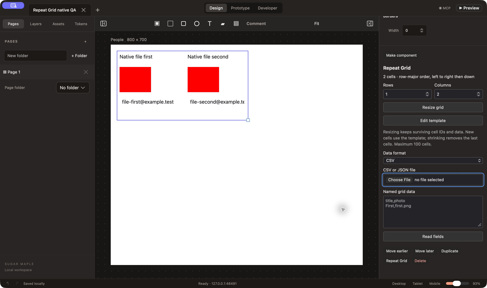

# Repeat Grid data acceptance — October 1, 2026

Issue #48 now supports named CSV/JSON fields, local PNG/JPEG/WebP image mapping, preview/cancel, and one undoable import. The inspector shows row/column capacity, explicit truncation and missing-value policies. Resize keeps surviving cell IDs and overrides; Edit template selects a separate hidden master. Changing template styling preserves imported per-cell text, input values and images. A legacy grid is upgraded inside its undoable command without changing surviving cell IDs.

Import order is row-major (increasing `repeatIndex`). More source rows than visible cells are rejected unless truncation is explicitly selected. All supplied rows, including truncated rows, are validated. Unmapped source columns are ignored and reported. Fewer rows leave trailing cells untouched. An absent or empty mapped field follows the selected retain/clear/error policy; JSON values must be strings. A source image value is an exact filename from the chosen local files, never a URL or filesystem path. Unknown mappings, duplicate target/property mappings, malformed data and invalid images reject the whole batch before mutation. Preview checks against an ephemeral checkpoint; cancel and cancelled native file pickers preserve the complete authored checkpoint and undo history.

The data source is limited to 1 MB, 1,000 rows, 100 fields and 20,000 characters per string; a grid supports at most 100 visible cells. Images use canonical base64, MIME/signature checks and SHA-256 references in a shared document table, followed by actual pixel decoding before editor/MCP commit. Images are limited to 5 MB each and 8 MB in the shared table. The 32 MB native checkpoint limit includes the undo journal and Foundation-compatible slash escaping. Replacing images can retain unused historical content; compaction is future persistence work, not a claim that arbitrary-size assets are supported.

Editable clipboard payloads carry the referenced images; paste remaps the internal Repeat Grid template and cells. Save/reopen and journal undo/redo retain image references. HTML, Angular, Tailwind and SVG resolve references to embedded image data. SwiftUI emits shared embedded bytes and a platform image wrapper. A real macOS Swift compiler/NSHostingView consumer compiles and renders the generated output; the UIKit conditional branch remains unverified. Full mapped library/SwiftUI parity remains #17/#49.

Validation: 59 model tests / 409 assertions pass. Nineteen browser/consumer suites pass, with final Repeat Grid and component suites rerun after the last private-template palette guard. Browser tests choose CSV/JSON files and PNG bytes through the actual inspector, reject empty/oversized/corrupt imports without mutation, exercise preview/cancel/truncation/resizing/template edits, compare actual red Canvas pixels and run an offline DOM preview. Strict Angular and Tailwind consumers compile; HTML/SVG output embeds and decodes the image deterministically. Typecheck and production web/mac build pass. Six native fixtures, stdio transport and three compiled macOS SwiftUI consumers pass.

Actual native testing used only the owned Debug app `io.zubair.SugarMaple.RepeatQA`, profile `build/repeat-qa/profile`, port 48491. The helper refuses other profiles/ports and does not print its token. SDK tests verify atomic rejection, stable resizing, shared scoped assets, deterministic exports and durable autosave. CUA selected the owned `people.csv` and `pixel.png` through real NSOpenPanels, mapped title/photo/email, previewed and applied one batch. The SDK proved exact checkpoint preservation during preview/cancel, one journal batch on apply and exact undo/redo. Both imported images rendered as red pixels. Cancelling a subsequent file picker preserved the checkpoint. After a normal quit/reopen, the final file import matched the durable saved checkpoint and complete undo journal exactly; the owned app was quit again.

These tests found and fixed two product bugs. An optional journal asset field inherited a schema default of `{}`, erasing unchanged assets during replay after a resize; removing that default and adding reopen-after-resize/undo assertions fixed it. The native WKWebView lacked a file-panel delegate, so actual file input controls were inert. A trusted authoring-main-frame-only NSOpenPanel delegate now supports CSV/JSON/image input while preview, subframes, external origins and directory imports remain denied.

Test observations are retained honestly: one contended model attempt exceeded the existing five-second 5,000-node timeout; a rerun passed all 59 tests in 1.84 seconds without relaxing the limit. Initial native AX focus/coordinate attempts did not apply data and were followed by verified real file import. The SDK helper initially called unpublished `render.ready`; it now uses the actual `render.capture` tool. A first restart invocation used the wrong support environment variable and was rejected by the owned-profile guard; the corrected invocation verified the final saved data. Production build retains the existing stylesheet budget warning.

The candidate still requires exact-head CI, review and merge before #48 closes. Full registry/grid handles/virtual cells (#12/#13), asset/font catalog and crop/fit UI (#19), historical asset compaction and complete release acceptance (#7/#21), production library mappings and isolated code execution (#49/#51) remain open. Raw logs and verification.json give the boundaries of each check.

## Review follow-up

The actual first review (session `1433770453613650310`) blocked the PR's review-gate wording and alleged that clipboard asset access fails on ordinary nodes. `NodeSchema` supplies an empty-string asset default, and the real plain-node consumers already pass; the follow-up still adds optional access for legacy sparse callers and a complete copy/paste/reopen/undo regression. The PR wording was removed. The suggested image byte-copy improvement is also applied using one allocated buffer and a linear loop. Final local acceptance is now 60 model tests / 415 assertions; updated exact-head CI passed and the subsequent actual review approved (session `536419113508875813`) before merge. The first verdict remains visible and is not rewritten.
