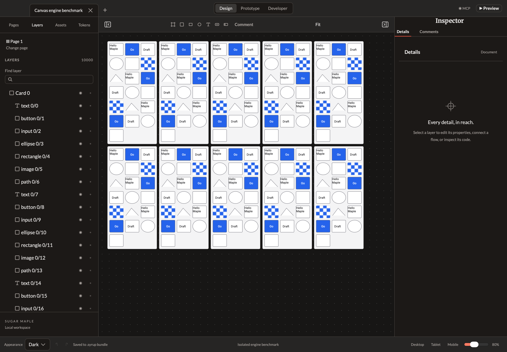

# Windowed Layers acceptance — October 1, 2026

The full Layers tree previously mounted 1,000 or 10,000 Maple row components. The production panel now renders a fixed-height visible window with eight rows of overscan on either side and at most two extra focus/tab-stop pins. The complete authored tree stays in the document. An OnPush panel owns row indexing, selection membership and focus so unrelated camera updates do not recheck every layer. Named search keeps ancestor context and sibling order. The parent retains the search text across panel recreation.

Keyboard Up/Down, Left/Right and Home/End work across unmounted rows without changing scene state/history. Navigation tracks the pending destination during rapid key repeats and ignores superseded render callbacks. A visibility/lock control keeps its actual DOM node while scrolling away; its arrow keys do not nudge the selected Canvas node. Canvas/MCP selection reveals an unmounted target, Shift activation retains multi-selection, and resize clamps the scroll extent. The actual treeitems expose their full sibling positions/counts and depth through the adapted Maple ARIA inputs. These tests do not establish complete VoiceOver or IME acceptance.

## Measured comparison

The [pre-change production baseline](../canvas-engine-benchmark-2026-10-01/README.md) is preserved unchanged. Both runs used the exact same SHA-256-bound 1,000/200-visible and 10,000/200-visible mixed-node fixtures on this Apple M5 Max / 128 GiB machine, content size 1440×1000, DPR 2, Chrome 154 and macOS 27 WKWebView. The new run binds production runtime commit `0670d03f9575f7365cf7e35303ea7c6968d6c53a`, including merged library support and the durable reload regression. The compressed original input checkpoints are preserved here and verified against the baseline fixture hashes; current schema normalization may add empty metadata defaults without changing the authored fixture geometry. Browser timer/refresh scheduling and startup vary across runs; this is one before/after comparison, not a repeated reference-hardware SLA.

| Engine / total nodes | Mounted rows before → after | Layers opening before → after | Layers pan callback p95 before → after | Intervals above 1.5× own idle median before → after |
| --- | ---: | ---: | ---: | ---: |
| Chrome / 1,000 | 1,000 → 26 | 93.2 → 32.2 ms | 18.3 → 17.8 ms | 0 → 0 / 360 |
| Chrome / 10,000 | 10,000 → 26 | 1148.5 → 32.3 ms | 33.7 → 18.1 ms | 98 → 0 / 360 |
| WKWebView / 1,000 | 1,000 → 26 | 140.0 → 33.0 ms | 23.0 → 18.0 ms | 9 → 2 / 360 |
| WKWebView / 10,000 | 10,000 → 26 | 1294.0 → 32.0 ms | 24.0 → 18.0 ms | 13 → 0 / 360 |

All phases use the same 360 samples, ordinary synthetic wheel handling and observed rAF/paint advancement. No synchronous Canvas flush is used. Every visible checker image passes the exact pixel proof; all camera phases keep 200 nodes drawn; the entire authored checkpoint/journal is byte-for-byte unchanged. Chrome additionally receives a separate trusted Playwright wheel. Native timing uses a visible fresh WKWebView with only in-memory recovery/status/autosave capabilities. Real native disk/MCP/clipboard costs, OS input latency and compositor presentation are excluded. Chrome JS heap after the 10,000-node Layers phase is 247.3 MiB versus 398.0 MiB previously; that is a scoped diagnostic with tracing/automation overhead, not whole-app memory acceptance.

`run-state.json` confirms all four cases finished and binds the exact generated harness, fixtures, reports and production bundle files. Raw samples, engine reports and actual screenshots are committed. Large Chrome traces remain in the ignored local `build/virtual-layers-engine-benchmark/` folder, with their hashes recorded here. The frozen adapter manifest records every source hash and replacement: harness output/root/native-source paths, frozen checkpoint loading and the mounted-row assertion. The drawing fixture and timing loops are unchanged. The baseline used Bun 1.4.3; this harness runner uses project-pinned Bun 1.4.2. That does not replace the measured browser/native engines, but remains an environmental difference.

Reproduce after building the production bundle:

```sh
bun run build:web
bun tools/layers-engine-benchmark.ts
```

The frozen baseline commit `48978d5646f8155c4067cb1f9c12117c1a510806` must exist in local git history. The regular `canvas-engine-benchmark.ts` also accepts full or windowed Layers panels and verifies full model count separately from mounted count.

## Behavior and integration evidence

Project-pinned Bun 1.4.2 passes 70 model tests / 493 assertions after library/main integration. The full 23 browser/consumer suites pass; final targeted chrome and 10,000-layer tests cover the last keyboard/resize safeguards. TypeScript checking and production web/Mac builds pass. Complete native acceptance checks preview isolation, recovery, structured clipboard, MCP/stdio and compiled SwiftUI consumers separately from the performance harness. Raw logs retain the existing stylesheet-budget and Swift weak-variable warnings. Browser fixture I/O uses a fixed recovery/status/autosave bridge only and never accesses the user's clipboard or files.

The 10,000-layer browser fixture proves bounded DOM, sibling ARIA, rapid off-window navigation, focused control retention, a visibility change with exactly one undo step, external selection reveal, multi-selection, contextual search, empty-result clearing, resize and panel recreation. Its initial key-repeat failure led to the pending-focus fix. The integrated library test previously reloaded during asynchronous autosave; it now verifies the complete checkpoint/journal in actual IndexedDB before unloading, preserving the exact reload assertion. The failed observation and subsequent full pass are retained. A later assertion used `selection` instead of the actual `selectionIds` discovery field; correcting the test established the intended multi-selection behavior. Neither failure was hidden by relaxing a threshold.

This completes the Layers DOM virtualization follow-up within #8 once reviewed, merged and checked on resulting main. #8 stays open for all-direction resize/rotation, snapping/distribution, rotated-parent gesture coverage and remaining locked/hidden editing parity. #2's full release-performance gate remains open: no ≤16.7 ms physical frame-presentation claim is made. This change also does not close the broader authoring/accessibility/release issues #9/#21.


