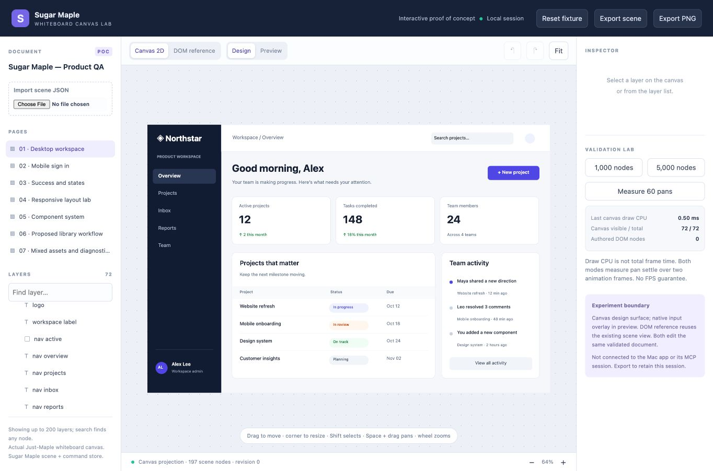

# Sugar Maple × Just-Maple Whiteboard POC

The integrated editor now uses this Whiteboard canvas architecture. See [the canvas delivery record](../../docs/development/canvas-port.md). This folder preserves the earlier standalone experiment and its original model snapshots; it is not imported by the shipping editor.

An interactive experiment that renders Sugar Maple scenes through the actual Just-Maple Whiteboard `CanvasComponent`. It shares a validated Sugar Maple document and command store with a DOM reference view, so rendering and editing can be compared on the same scene.



## Run

```sh
cd '/Users/riabuz/Projects/_Sugar Maple/prototypes/whiteboard-ui'
bun install --frozen-lockfile
bun run start
```

Open <http://127.0.0.1:48482/>. The development server binds to loopback. This prototype is independent of the Mac editor and its MCP session. Edits live in memory; refreshing or resetting discards them. Export is provided, but browser download delivery is not yet verified in the in-app browser.

```sh
bun run typecheck
bun run test
bun run build
```

The production output is `dist/browser`. The lockfile pins dependencies; no sibling checkout is required to run or build this snapshot.

## What to try

1. Toggle **Canvas 2D / DOM reference** on the desktop workspace. Both views use the same document, page and camera. The DOM reference uses Sugar Maple's existing scene renderer.
2. Select a layer on the canvas or in the layer list. Drag to move; drag its bottom-right handle to resize. Use the inspector to edit geometry, text, fill, radius and layout. Undo restores each completed gesture in one step. Shift selects multiple nodes. Space-drag pans; the wheel zooms; **Fit** frames the current page.
3. Open **Mobile sign in**, choose **Preview**, click the email field and type into the native overlay. Click **Sign in** to follow the authored link to the success page. Preview input values do not alter the authored document.
4. Inspect **Responsive layout lab**, **Component system**, and **Mixed assets**. These are fixture pages, not claims that every feature has production parity. **Proposed library workflow** is a mockup, not a working JavaScript or Swift library importer.
5. Load **1,000 nodes** or **5,000 nodes**, then run **Measure 60 pans**. Reset returns to the seven-page, 197-node QA fixture. Stress fixtures include one additional root artboard.

Scene/checkpoint JSON can be imported. Import validates the document and starts fresh history; it does not restore the checkpoint's journal. PNG export captures the canvas viewport, not an artboard export or the inspector/native input overlay. The PNG button is disabled in DOM mode.

## What is reused

Source: `../Just-Maple/packages/whiteboard`, revision `38c2e6793b4602418b669909865d2292d43a842d`. The similarly named `../JustMaple` checkout contains an older InkCanvas coupled to editor/tag services; this POC uses the reusable Whiteboard package.

- The vendored `CanvasComponent` retains the Whiteboard camera, pointer event handling, resize observation, touch/pan/zoom handling and animation-frame loop.
- `RendererService` is replaced at the existing integration seam by a new Sugar Maple Canvas2D painter. The stock drawing renderer is preserved as `stock-renderer.reference.ts` for comparison and excluded from the build. The stock renderer did not already support Sugar Maple UI nodes.
- `UITool` adapts Whiteboard pointer coordinates to Sugar Maple selection, hit testing, drag and resize commands.
- `src/model` snapshots Sugar Maple's document schema, command store and related model files. `src/dom` snapshots its scene view. `public/seed.json` comes from the earlier MCP product QA fixture.
- Real Yjs document/awareness objects satisfy the Whiteboard component interface and notify projection changes. Authored data stays in the Sugar Maple store. There is no collaboration transport or second authored Yjs document model.

The vendor component has three deliberate integration changes: deletion emits a command intent instead of editing Whiteboard elements directly; keyboard shortcuts ignore editable controls; document observers are detached during destruction. Supporting Whiteboard types and provider interfaces are narrowed to this POC. Original file hashes are recorded in `provenance.json`; they describe the source files before these changes. Existing source comments are preserved. No new upstream license claim is made.

## Architecture and product decision

```text
Sugar Maple document + validated commands + undo
                 |
         scene/layout projection
            /             \
  Canvas2D UI painter    existing DOM scene view
            |
  Just-Maple CanvasComponent (camera + pointer lifecycle)
            |
  UITool + inspector -> Sugar Maple commands
```

The POC supports pursuing a **canvas design surface with native editing overlays**. It demonstrates reuse of the Whiteboard input/camera element and preservation of Sugar Maple commands. It does not establish that the full product should switch renderers.

Before adoption, the next gates are:

1. **Layout and visual parity:** a golden fixture suite against the existing renderer, including nested fill/hug/grid, fonts, wrapping, clipping, transforms, effects and assets.
2. **Editing and accessibility:** caret/selection/IME support through native text overlays; keyboard navigation, focus and an accessible scene representation. Canvas currently has no authored accessibility tree.
3. **Native integration:** connect the projection to the existing Mac/MCP document lifecycle; validate WKWebView input, DPR, persistence, selection and undo without creating competing sources of truth.
4. **Performance evidence:** profile layout, hit testing, draw submission, GPU/compositing, memory and event latency on representative nested UI scenes. Compare at multiple viewport sizes and device classes.
5. **Export fidelity:** verify saved JSON round trips and artboard/image export independently of viewport screenshots and browser downloads.

Current limits include approximate intrinsic text sizing and basic wrapping, axis-aligned hit bounds for rotated nodes, incomplete nested transform handling, approximate radial gradients, and missing effects. This is not a React/JavaScript runtime, SwiftUI host or secure/native form renderer. The native preview input is generic. Layer search can find every node, but the visible list is capped at 200 entries.

## Validation recorded on October 1, 2026

Production build and TypeScript checking passed. Three focused tests passed with ten assertions: fixed/fill horizontal layout, topmost hit testing with parent clipping, and command/undo behavior with atomic invalid-size rejection. Logs and structured results are in `validation/`.

Browser checks passed for canvas dragging, corner resizing with one-step undo, shared text editing/undo across Canvas and DOM, multiline text preservation, native preview input and cross-page navigation without authored document changes. Representative DOM and canvas geometry agreed for a fill row and grid cells. Final browser error capture was empty.

Measured locally in the Codex in-app browser, approximately 1364 × 900 CSS viewport, Apple M5 Max / 128 GB, stress scenes at 100% zoom. The final captured viewport is 1364 × 902:

| Fixture | Authored nodes | Canvas items drawn | Pan settle median / p95 | Canvas draw CPU median / p95 |
| --- | ---: | ---: | --- | --- |
| Canvas 1,000 | 1,001 | 133 | 33.30 / 34.30 ms | 0.50 / 0.60 ms |
| DOM 1,000 | 1,001 | n/a | 33.30 / 33.50 ms | Not measured |
| Canvas 5,000 | 5,001 | 133 | 33.30 / 33.70 ms | 0.70 / 1.60 ms |

Each run warms up ten pans, then measures sixty alternating two-unit camera pans, awaiting two animation frames per sample. Pan settle includes that wait; it is not an FPS or paint-CPU result. Canvas CPU measures synchronous draw submission, excluding GPU/compositing and the whole frame. The visible authored DOM count was zero in Canvas mode and 1,001 in DOM mode on the 1,000-node fixture. UI chrome is still DOM.

These simple tiles demonstrate viewport culling, not performance for 5,000 complex nested components. No 5,000-node DOM benchmark or native WKWebView run is claimed. An initial stress-fixture height exceeded the document schema's 10,000-unit limit; the fixture was corrected and the recorded 5,000-node run verified 5,001 total nodes. That was a POC fixture defect, not a Sugar Maple schema defect.

Export PNG download automation timed out in the in-app browser; no saved export file was verified. JSON download delivery/import round trip remains unverified. The JPEG above is independently captured browser evidence, not proof of the PNG exporter.
